# 🚀 tPay SDK Developer Integration Guide

## Overview

tPay SDK provides AI agents with **autonomous financial capabilities** - essentially giving your agents the ability to open bank accounts and execute payments independently. This enables agents to make financial decisions and complete transactions as part of their autonomous decision-making process.

## 🏗️ tPay SDK Architecture

```mermaid
graph TB
    A[🤖 Your AI Agent] --> B[🧠 Agent Decision Engine]
    B --> C[🛠️ tPay SDK Tools]
    
    C --> D[🆔 Agent Identity]
    C --> E[💰 Balance Management]
    C --> F[💳 Autonomous Payment]
    C --> G[🔍 Transaction Tracking]
    
    D --> H[📊 tRadar Compliance]
    E --> H
    F --> H
    G --> H
    
    H --> I[🌐 Multi-Chain Networks]
    I --> J[⛓️ Solana]
    I --> K[⛓️ XRPL]
    I --> L[⛓️ Other Networks]
    
    M[🏦 Traditional Banking] -.->|Replace| C
    N[💳 Manual Payments] -.->|Automate| F
    O[👨‍💼 Human Oversight] -.->|Autonomous| B
    
    style A fill:#e1f5fe
    style C fill:#f3e5f5
    style H fill:#e8f5e8
    style I fill:#fff3e0
```



## 📋 Core Capabilities

### 🏦 **Digital Banking for Agents**
- **Agent Account Creation**: Programmatically create financial identities for your agents
- **Multi-Asset Support**: Handle various cryptocurrencies (USDT, XRP, SOL, etc.)
- **Real-time Balance Tracking**: Query agent balances across multiple networks

### 💸 **Autonomous Payment Processing**
- **Direct Transfers**: Agent-to-agent payments without human intervention
- **Smart Routing**: Automatic network selection and optimization
- **Transaction Verification**: Built-in compliance and fraud protection

### 🤝 **Agent-to-Agent Commerce**
- **Dispute Resolution**: Autonomous conflict resolution between agents
- **Challenge Handling**: Smart retry mechanisms for failed transactions
- **Cross-Network Operations**: Seamless payments across different blockchain networks

## 🛠️ Installation & Setup

### Prerequisites

**System Requirements:**
- Python 3.8 or higher
- Internet connection for API calls
- API credentials from tPay portal

**Environment Setup:**
```bash
# Create virtual environment (recommended)
python -m venv tpay_env
source tpay_env/bin/activate  # On Windows: tpay_env\Scripts\activate
```

### Installation Options

**📦 Option 1: Basic Installation (Synchronous)**
```bash
pip install tpay
```

**⚡ Option 2: Full Installation (Async Support)**
```bash
pip install tpay[async]
# or
pip install tpay[all]
```

**🔧 Option 3: Development Installation**
```bash
# From /dist
pip install tpay-0.1.1.tar.gz[async]
```

### Dependencies

**Core Dependencies (Auto-installed):**
- `requests>=2.25.1` - HTTP requests for sync operations
- `python-dotenv>=0.19.0` - Environment variable management

**Optional Dependencies:**
- `httpx>=0.24.0` - For async operations (with `[async]` install)
- `pydantic>=2.0.0` - Data validation (optional)

## 🔧 Step-by-Step Integration

### Step 1: 🔑 Get API Credentials

1. Visit [tPay Portal](https://portal.t54.ai) and create an account
2. Create a new project and obtain:
   - `API_KEY` - Your authentication key
   - `API_SECRET` - Your secret key  
   - `PROJECT_ID` - Your project identifier

### Step 2: 🌍 Environment Configuration

Create a `.env` file in your project root:

```bash
# .env file
TLEDGER_API_KEY=your_api_key_here
TLEDGER_API_SECRET=your_api_secret_here
TLEDGER_PROJECT_ID=your_project_id_here
TLEDGER_API_BASE_URL=https://api.t54.ai/api/v1
```

### Step 3: 🚀 Initialize SDK

```python
import tpay
from dotenv import load_dotenv
import os

# Load environment variables
load_dotenv()

# Initialize tPay SDK
tpay.tpay_initialize(
    api_key=os.getenv("TLEDGER_API_KEY"),
    api_secret=os.getenv("TLEDGER_API_SECRET"),
    project_id=os.getenv("TLEDGER_PROJECT_ID"),
    base_url=os.getenv("TLEDGER_API_BASE_URL"),
    timeout=30  # Optional: request timeout in seconds
)

print("✅ tPay SDK initialized successfully!")
```

### Step 4: 🤖 Create Agent Financial Identity

```python
# Create a new agent with financial capabilities
agent_data = tpay.create_agent(
    name="Shopping Assistant Agent",
    description="Autonomous shopping agent with payment capabilities",
    agent_daily_limit=1000.0,  # Daily spending limit
    agent_type="autonomous_agent"
)

if agent_data:
    agent_id = agent_data['id']
    print(f"🎉 Agent created with ID: {agent_id}")
else:
    print("❌ Failed to create agent")
```

### Step 5: 🛠️ Register Financial Tools

```python
# Create tPay financial tools for your agent
balance_tool = tpay.tpay_toolkit_balance()
payment_tool = tpay.tpay_toolkit_payment()

# Get tool definitions for LLM integration
financial_tools = tpay.get_all_tool_definitions()

print(f"📋 Registered {len(financial_tools)} financial tools")
```

### Step 6: 🧠 Integrate with Your Agent

```python
from openai import OpenAI

# Your existing agent tools
custom_tools = [
    {
        "type": "function",
        "function": {
            "name": "search_products",
            "description": "Search for products to purchase",
            "parameters": {
                "type": "object",
                "properties": {
                    "query": {"type": "string"}
                }
            }
        }
    }
]

# Add tPay financial capabilities
all_tools = custom_tools + financial_tools

# Create agent with financial capabilities
client = OpenAI(api_key="your_openai_key")

def create_financial_agent():
    return client.chat.completions.create(
        model="gpt-4",
        messages=[
            {
                "role": "system",
                "content": """You are an autonomous agent with financial capabilities.
                
                Available financial tools:
                🏦 get_agent_balance(agent_id) - Check agent's current balance
                💳 create_payment(agent_id, receiving_agent_id, amount, currency, settlement_network) - Execute payments
                
                You can autonomously:
                - Check your financial capacity before making decisions
                - Execute payments to complete transactions
                - Handle payment challenges and retries
                
                Make financial decisions independently based on user needs and available balance."""
            }
        ],
        tools=all_tools,
        tool_choice="auto"
    )
```

### Step 7: 🎯 Execute Financial Operations

```python
# Tool execution handler
def execute_financial_tool(tool_name: str, args: dict):
    """Execute financial tools called by your agent"""
    
    if tool_name == "get_agent_balance":
        return balance_tool(**args)
    
    elif tool_name == "create_payment":
        # Set default parameters if not provided
        if "currency" not in args:
            args["currency"] = "USDT"
        if "settlement_network" not in args:
            args["settlement_network"] = "solana"
        
        return payment_tool(**args)
    
    else:
        raise ValueError(f"Unknown financial tool: {tool_name}")

# Example: Agent checks balance before making a purchase
balance_result = execute_financial_tool("get_agent_balance", {
    "agent_id": agent_id
})

print(f"💰 Agent balance: {balance_result}")

# Example: Agent executes autonomous payment
payment_result = execute_financial_tool("create_payment", {
    "agent_id": agent_id,
    "receiving_agent_id": "merchant_agent_123",
    "amount": 25.0,
    "currency": "USDT",
    "settlement_network": "solana"
})

print(f"💳 Payment result: {payment_result}")
```

### Complete End-to-End Example

Please check the Use Cases we provide as a guidance.

## ⚡ Async Integration (Advanced)

For high-performance applications requiring concurrent operations:

```python
import asyncio
import tpay

async def async_agent_operations():
    """Demonstrate async financial operations"""
    
    # Initialize SDK (same as sync)
    tpay.tpay_initialize(...)
    
    # Create multiple agents concurrently
    agents = await asyncio.gather(
        tpay.async_create_agent("Agent 1", "Shopping assistant"),
        tpay.async_create_agent("Agent 2", "Trading assistant"),
        tpay.async_create_agent("Agent 3", "Payment processor")
    )
    
    # Check all agent balances concurrently
    balances = await asyncio.gather(
        tpay.async_get_agent_asset_balance(agents[0]['id'], "solana", "USDT"),
        tpay.async_get_agent_asset_balance(agents[1]['id'], "solana", "SOL"),
        tpay.async_get_agent_asset_balance(agents[2]['id'], "xrpl", "XRP")
    )
    
    print("🚀 All operations completed concurrently!")
    return agents, balances

# Run async operations
asyncio.run(async_agent_operations())
```

## 🔒 Security & Compliance

### Automatic Audit Trail

```python
# All financial operations are automatically audited
@tpay.taudit_verifier
def audited_financial_operation():
    """
    This function is automatically:
    ✅ Tracked and logged
    ✅ Compliance-verified
    ✅ Cryptographically signed
    ✅ Risk-assessed
    """
    pass

# Agent tool calls are automatically tracked
@tpay.tradar_verifier
def tracked_tool():
    """
    Tool usage is automatically:
    ✅ Monitored for behavior patterns
    ✅ Recorded for analytics
    ✅ Verified for authenticity
    """
    pass
```

### Error Handling

```python
from tpay.exceptions import TPayError, TPayAPIError

try:
    payment_result = payment_tool(
        agent_id="agent_123",
        receiving_agent_id="merchant_456",
        amount=100.0
    )
except TPayAPIError as e:
    print(f"❌ API Error: {e.message}")
    print(f"Status Code: {e.status_code}")
    
except TPayError as e:
    print(f"❌ tPay Error: {e}")
    
except Exception as e:
    print(f"❌ Unexpected error: {e}")
```

## 🚦 Production Deployment

### Environment Setup

```python
# production.py
import tpay
import logging

# Configure logging for production
logging.basicConfig(level=logging.INFO)

# Production initialization
tpay.tpay_initialize(
    api_key=os.getenv("TLEDGER_API_KEY"),
    api_secret=os.getenv("TLEDGER_API_SECRET"),
    project_id=os.getenv("TLEDGER_PROJECT_ID"),
    base_url="https://api.t54.ai/api/v1",  # Production URL
    timeout=60  # Longer timeout for production
)
```

## 💡 Key Concepts

### 🤖 **Agent Autonomy**
Your agents gain the ability to make financial decisions independently:
- **Balance-aware decisions**: Agents check their financial capacity before acting
- **Autonomous transactions**: Complete payments without human intervention
- **Smart rejection handling**: Automatically retry failed transactions with enhanced data

### 🔄 **Integration Philosophy**
The SDK is designed to augment your existing agent capabilities:
- **Non-intrusive**: Add financial capabilities without changing core agent logic
- **Tool-based**: Financial operations are exposed as callable tools
- **Autonomous**: Agents decide when and how to use financial capabilities

## 🎯 Next Steps

1. **📚 Study Use Cases**: Check out our [Shopping Assistant Use Case](use_case_shopping_assistant.md) to see real-world implementation
2. **🧪 Test Integration**: Start with small transactions in development mode
3. **📈 Scale Up**: Implement async operations for production workloads
4. **🔍 Monitor**: Use built-in analytics to optimize agent financial behavior

## 🔗 Additional Resources


---

*Ready to give your AI agents financial superpowers? Start building with tPay SDK today!* 🚀💳 