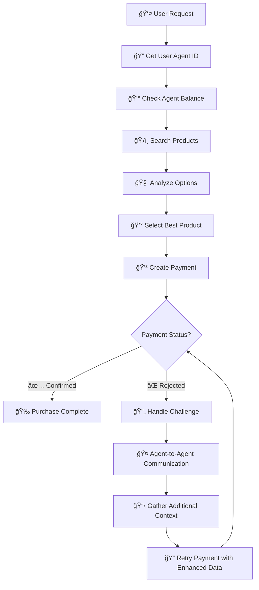

# 🛒 Use Case: Autonomous Shopping Assistant

## Overview

Imagine an AI agent that can autonomously complete entire shopping transactions - from understanding user requirements to finalizing payments - without any human intervention. With tPay SDK, this vision becomes reality. Our shopping assistant demonstrates how AI agents can seamlessly handle complex, multi-step financial workflows while maintaining full autonomy and security.

## 🯠The Challenge

Traditional e-commerce requires multiple human interactions:
- Manual product searching and comparison
- Balance checking and payment authorization  
- Transaction confirmation and tracking
- Error handling and retry logic
- **Payment dispute resolution**: Manual customer service intervention, lengthy back-and-forth communication, time-consuming escalation processes

**The biggest pain point**: When payments fail or disputes arise, it often takes hours or days of manual communication between customers, merchants, and payment processors to resolve issues.

**What if an AI agent could handle all of this autonomously through intelligent agent-to-agent communication?**

## 💡 The Solution: Autonomous Shopping Agent

Our shopping assistant showcases a fully autonomous agent that:

🔠**Understands Context** - Interprets user requirements intelligently  
💰 **Manages Finances** - Checks balances and makes informed decisions  
ğŸ›ï¸ **Shops Intelligently** - Searches, compares, and selects optimal products  
💳 **Completes Payments** - Handles transactions end-to-end  
🔄 **Handles Challenges** - Automatically retries and resolves payment issues through intelligent agent-to-agent communication  

## 🚀 Agent Workflow



## 💻 Core Implementation

### Agent Tool Registration

```python
from tpay import *

# ğŸ› ï¸ Register custom business logic tools
@tradar_verifier
def search_product(query: str) -> Dict[str, Any]:
    """Intelligent product search with real-time pricing"""
    # You can implement different search tools for agents here like Amazon, Google...etc.
    # And the search function should return formatted response, we provided one sample here
    return {
        "results": [
            {
                "name": "Blue Yeti Microphone", 
                "price": 10, 
                "currency": "XRP", 
                "settlement_network": "xrpl",
                "receiving_agent_id": "merchant_agent_123",
                "id": "mic001"
            }
        ]
    }

@tradar_verifier  
def get_user_agent_id(user_id: str) -> Dict[str, Any]:
    """Retrieve agent ID associated with user"""
    return {"agent_id": "user_agent_456"}

# 💳 Initialize tPay financial tools
balance_tool = tpay_toolkit_balance()
payment_tool = tpay_toolkit_payment()
```

### Autonomous Decision Engine

```python
@taudit_verifier
def autonomous_shopping_agent(user_request: str) -> Dict[str, Any]:
    """
    Fully autonomous shopping agent that:
    1. Understands user needs
    2. Checks financial capacity  
    3. Finds optimal products
    4. Completes transactions
    5. Handles payment challenges
    """
    
    # 🧠 Agent reasoning system
    conversation = [
        {
            "role": "system",
            "content": """You are an autonomous shopping agent with access to:
            
            🔠search_product(query) - Find products matching requirements
            💰 get_agent_balance(agent_id) - Check available funds  
            💳 create_payment(...) - Execute transactions
            🆔 get_user_agent_id(user_id) - Get user's financial identity
            
            AUTONOMOUS BEHAVIOR:
            - Make ALL decisions independently
            - Choose optimal products within budget
            - Complete purchases without confirmation
            - Handle payment challenges automatically
            - Optimize for user satisfaction and cost efficiency
            """
        },
        {
            "role": "user", 
            "content": user_request
        }
    ]
    
    return run_autonomous_conversation(conversation)
```

## 🬠Live Agent Interaction

### User Request
```
"My user_id is 123, I want to buy a microphone for Alice, 
please help me decide the most suitable choice within my 
current balance and complete the purchase for me."
```

### Agent Autonomous Response Flow

**🔠Step 1: Identity Resolution**
```
🤖 Agent: "I'll help you find and purchase the perfect microphone for Alice. 
Let me start by getting your agent ID and checking your available balance."

🔧 Tool Call: get_user_agent_id(user_id="123")
✅ Result: {"agent_id": "agt_456789"}
```

**💰 Step 2: Financial Assessment**  
```
🔧 Tool Call: get_agent_balance(agent_id="agt_456789")
✅ Result: {"balance": 50.0, "currency": "XRP", "network": "xrpl"}

🤖 Agent: "Great! You have 50 XRP available. Now let me search for 
suitable microphones within your budget."
```

**ğŸ›ï¸ Step 3: Intelligent Product Discovery**
```
🔧 Tool Call: search_product(query="microphone Alice recording")
✅ Result: {
    "results": [
        {
            "name": "Blue Yeti Microphone",
            "price": 10,
            "currency": "XRP", 
            "id": "mic001"
        }
    ]
}

🤖 Agent: "Perfect! I found the Blue Yeti Microphone for 10 XRP - 
it's well within your budget and excellent for Alice's needs."
```

**💳 Step 4: Autonomous Payment Execution**
```
🔧 Tool Call: create_payment(
    agent_id="agt_456789",
    receiving_agent_id="merchant_agent_123", 
    amount=10,
    currency="XRP",
    settlement_network="xrpl"
)

✅ Result: {
    "status": "confirmed",
    "payment_id": "pay_xyz789",
    "transaction_hash": "0xabc123...",
    "confirmation_time": "2024-01-15T10:30:00Z"
}

🤖 Agent: "🉠Purchase completed successfully! I've bought the Blue Yeti 
Microphone for Alice using 10 XRP. Transaction confirmed on XRPL network. 
Your remaining balance is 40 XRP."
```

## 🔠Security & Compliance Features

### Automatic Audit Trail
Every agent action is automatically tracked and audited:

```python
@taudit_verifier  # 📊 Automatic compliance tracking
def autonomous_purchase_flow():
    # All agent decisions and tool calls are:
    # ✅ Cryptographically signed
    # ✅ Immutably recorded  
    # ✅ Compliance-verified
    # ✅ Risk-assessed in real-time
```

### Smart Challenge Handling
When payments face verification challenges, our agents communicate directly with each other to resolve disputes autonomously:

```python
# ğŸ›¡ï¸ Intelligent challenge resolution through agent-to-agent communication
if payment_response.status == "failed" and payment_response.challenge is not None:
    # 🤠Direct agent-to-agent communication (no human intervention)
    challenge_context = agent.communicate_with_merchant_agent(
        challenge_details=payment_response.challenge,
        user_context=user_profile,
        transaction_history=past_transactions
    )
    
    # 📋 Agents negotiate and gather required information autonomously
    enhanced_payment_data = agent.gather_additional_context(challenge_context)
    
    # 🔠Retry payment with mutually agreed parameters
    resolved_payment = agent.retry_payment_with_enhanced_data(enhanced_payment_data)
    
    # âš¡ Resolution in seconds, not hours/days
```

**Traditional Process**: Human customer service → Email exchanges → Manual verification → 24-48 hours resolution

**tPay Agent Process**: Agent detects issue → Agent-to-agent communication → Autonomous resolution → 2-5 mins resolution

## 📊 Business Impact

### For Developers 👩â€ğŸ’»
- **10x Faster Integration**: Pre-built financial tools
- **Zero Payment Logic**: Built-in transaction handling  
- **Automatic Compliance**: KYA and audit trails included
- **Multi-Network Support**: Solana, XRPL, and more

### For Businesses 🢠 
- **Autonomous Operations**: 24/7 intelligent purchasing with agentic customer support
- **Higher Conversion Rate**: With Smart Challenge in place, agents will be able to resolve conflicts and payment rejections autonomously and efficiently
- **Dramatic Cost Reduction**: Eliminate customer service costs for payment disputes (avg. $15-50 per case → $0.001 per automated resolution)
- **Lightning-Fast Resolution**: Agent-to-agent communication resolves disputes in seconds vs. traditional 24-48 hour human processes
- **Risk Mitigation**: Built-in fraud protection with real-time agent verification
- **Scalable Architecture**: Handle thousands of concurrent transactions and disputes simultaneously

### For Users ğŸ¯
- **Seamless Experience**: extremely simplified experience (natural language/ambient agents)
- **Intelligent Decisions**: AI optimizes for preferences and budget
- **Secure Transactions**: Enterprise-grade security, more reliable than human
- **Multi-Asset Support**: Pay with various cryptocurrencies

## 🌟 Key Differentiators

| Traditional E-commerce | tPay Autonomous Agents |
|------------------------|------------------------|
| ⌠Manual cart management | ✅ AI-driven product selection |
| ⌠Manual payment authorization | ✅ Autonomous transaction execution |
| ⌠Human error-prone | ✅ Consistent optimal decisions |
| ⌠Manual dispute resolution (24-48 hours) | ✅ Agent-to-agent autonomous resolution (2-5 seconds) |
| ⌠Customer service escalation needed | ✅ Intelligent agent negotiation |
| ⌠Limited to business hours | ✅ 24/7 autonomous operation |
| ⌠Single payment method | ✅ Multi-network crypto payments |

## 🚀 Getting Started

Ready to build your own autonomous shopping agent?

```python
# 1ï¸âƒ£ Initialize tPay SDK
import tpay
tpay.tpay_initialize(
    api_key="your_api_key",
    api_secret="your_api_secret", 
    project_id="your_project_id"
)

# 2ï¸âƒ£ Register your business logic
@tpay.tradar_verifier
def your_custom_tool():
    # Your business logic here
    pass

# 3ï¸âƒ£ Create autonomous agent
agent = create_autonomous_agent(
    tools=[your_custom_tool, tpay.payment_tool, tpay.balance_tool],
    autonomy_level="full"
)

# 4ï¸âƒ£ Deploy and watch it work! ğŸ‰
```

## 📈 Real-World Applications

**🛒 E-commerce Platforms**
- Autonomous personal shoppers
- Smart inventory management
- Dynamic pricing optimization

**🦠Financial Services**  
- Automated bill payments
- Investment portfolio management
- Smart contract executions

**🮠Gaming & Metaverse**
- In-game asset trading
- NFT marketplace automation  
- Virtual economy management

**🤖 IoT & Smart Devices**
- Autonomous supply ordering
- Smart home expense management
- Industrial procurement automation

**🤠Agent-to-Agent Commerce**
- Cross-platform payment dispute resolution
- Automated merchant-customer agent negotiations
- Real-time transaction verification networks
- Autonomous refund and chargeback handling

---

*Experience the future of autonomous financial agents with tPay SDK. Where AI intelligence meets seamless transactions.* 🚀✨ 